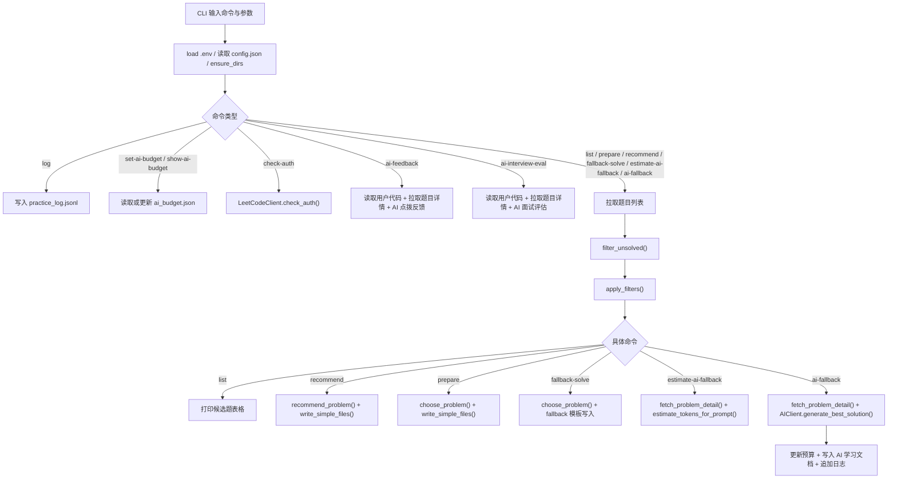

# Brush Script

面向 `leetcode.cn` 的辅助刷题训练应用。

它的定位不是“自动提交答案”，而是把刷题过程拆成一个更可管理的训练闭环：

`选题 -> 准备 -> 编码 -> 卡点求助 -> 面试评估 -> 复盘记录`

当前项目已经具备两类核心能力：

- 学习流辅助：题目筛选、推荐、学习文件生成、训练日志记录
- AI 强化辅助：参考解生成、错误驱动反馈、模拟头部大厂技术面试评估

## 项目目标

- 帮你稳定持续地刷题，而不是临时性地找题做题
- 把“我会不会”“我为什么错”“我离面试标准差多远”结构化下来
- 在保留自主思考的前提下，用 AI 做兜底、反馈和评估
- 支持国内主流技术面试语境，尤其强调算法正确性、复杂度、边界处理、代码表达与讲解能力

## 当前能力总览

### CLI 命令

- `list`：列出未完成题并支持按难度、标签筛选
- `prepare`：生成单题学习资产
- `recommend`：自动推荐下一题并生成学习资产
- `fallback-solve`：生成本地兜底模板
- `estimate-ai-fallback`：预估 AI 参考解调用成本
- `ai-fallback`：生成 AI 参考解
- `ai-feedback`：对你当前代码做“点拨式纠错”
- `ai-interview-eval`：按大厂面试标准做 PASS/FAIL 评估
- `set-ai-budget` / `show-ai-budget`：AI 成本预算管理
- `check-auth`：校验 `leetcode.cn` 登录 Cookie
- `log`：记录训练复盘

### Web 界面

通过 `Streamlit` 提供可视化入口：

- AI 参考解生成模式
- 模拟面试评估模式
- 训练模式预留入口
- AI 提供商与模型切换
- 预算查看与设置

### 打包与分发

- `run_brush_app.bat` / `run_brush_app.ps1`：本地一键启动 Web
- `build_exe.ps1` + `BrushScriptApp.spec`：生成 Win11 可执行应用
- `release.ps1`：整理最小可分发目录

## 架构总览

### 产品结构拆解

1. LeetCode 数据接入
   - 题目列表拉取
   - 题目详情拉取
   - 登录状态校验

2. 题目筛选与推荐
   - 未完成题过滤
   - 难度 / 标签过滤
   - 推荐排序策略

3. 学习资产生成
   - `plans/` 思路与学习文档
   - `solutions/` 代码模板或 AI 参考解
   - `tests/` 测试骨架

4. AI 辅助层
   - 参考解生成
   - 错误驱动反馈
   - 模拟面试评估

5. 成本控制层
   - token 预估
   - 调用预算
   - 周期重置

6. 展示层
   - CLI
   - Streamlit Web
   - Win11 EXE 打包启动

### 代码模块映射

- [main.py](E:\Github%20Project\Brush_Script\main.py)
  - CLI 入口
  - LeetCode API 调用
  - 题目筛选/推荐
  - 学习资产写入
  - AI 调用与预算控制

- [app.py](E:\Github%20Project\Brush_Script\app.py)
  - Streamlit 展示层
  - 按钮/表单驱动 CLI 命令

- [config.json](E:\Github%20Project\Brush_Script\config.json)
  - 工作目录、默认筛选、预算默认值

- [templates.json](E:\Github%20Project\Brush_Script\templates.json)
  - 标签模板

- `plans/`, `solutions/`, `tests/`, `logs/`
  - 学习产物和训练记录落盘区

## main.py 命令流

下面是目前 `main.py` 的主命令流拆解。



## main.py 数据流

```mermaid
flowchart LR
    A[".env"] --> B["运行时配置"]
    C["config.json"] --> B

    D["leetcode.cn GraphQL"] --> E["Problem 列表 / Detail"]
    E --> F["过滤与推荐层"]
    F --> G["plans/ solutions/ tests/"]

    H["用户代码文件"] --> I["AI 反馈 / AI 面试评估 Prompt"]
    E --> I
    I --> J["AIClient"]
    J --> K["反馈报告 / 面试报告"]

    L["ai_budget.json"] --> M["预算检查 / 剩余额度"]
    J --> M
    M --> L

    N["practice_log.jsonl"] <-- O["命令执行日志 / 训练复盘 / AI 调用记录"]
```

## 六大模块详细说明

### 1. LeetCode 数据接入

实现位置主要在 [main.py](E:\Github%20Project\Brush_Script\main.py) 的 `LeetCodeClient`。

已支持：

- `fetch_problemset()`
- `fetch_problem_detail()`
- `check_auth()`

输入：

- `.env` 中的 `LEETCODE_COOKIE`

输出：

- 题目列表对象 `Problem`
- 单题详情 `question detail`
- 登录状态

### 2. 题目筛选与推荐

已支持：

- `filter_unsolved()`：过滤已 AC 题目
- `apply_filters()`：按难度和标签筛选
- `recommend_problem()`：默认按难度优先、题号优先

当前策略适合“稳定训练”，但后续还可以扩展：

- 最近训练过的标签权重
- 弱项优先
- 面试高频题优先
- 计划驱动的推荐策略

### 3. 学习资产生成

当前会生成三件套：

- `plans/*.md`
- `solutions/*.py` 或 `solutions/ai_fallback_*.md`
- `tests/test_*.py`

此外，AI 辅助也已开始沉淀学习报告：

- `plans/ai_feedback_*.md`
- `plans/ai_interview_eval_*.md`

这意味着项目不再只输出“答案”，也开始输出“反馈资产”和“评估资产”。

### 4. AI 辅助层

当前已有三条主链路：

1. `ai-fallback`
   - 生成参考解
   - 支持 `compare` 多方案对比

2. `ai-feedback`
   - 对用户代码给出关键错误与修正方向
   - 不直接给完整正确代码

3. `ai-interview-eval`
   - 输出 PASS/FAIL
   - 进行维度化评分
   - 适配国内头部大厂和国际大厂面试语境

多模型支持：

- OpenAI
- DeepSeek
- Gemini
- Claude
- 自定义兼容 OpenAI 风格接口

### 5. 成本控制层

当前预算控制已比较完整：

- `logs/ai_budget.json`
- 每次调用前预算检查
- `estimate-ai-fallback`
- 日 / 月预算窗口
- 调用后自动累计使用量

本轮更新后，`ai-feedback` 与 `ai-interview-eval` 也纳入同一预算体系，而不是只统计参考解生成。

### 6. 展示层

CLI：

- 最完整、最直接的能力入口

Web：

- `app.py` 通过 `subprocess` 调用 CLI
- 更适合日常使用和可视化操作

Win11 打包：

- 通过 `PyInstaller` 与启动器脚本做桌面化分发

## 快速开始

### 1. 安装依赖

```bash
pip install -r requirements.txt
```

### 2. 配置环境变量

复制：

```bash
copy .env.example .env
```

填写关键项：

```env
LEETCODE_COOKIE=LEETCODE_SESSION=xxxx; csrftoken=yyyy; ...
DEFAULT_LANG=python3
DEFAULT_LIMIT=10

AI_PROVIDER=openai
OPENAI_API_KEY=...
OPENAI_MODEL=gpt-5.3
```

### 3. 校验登录

```bash
python main.py check-auth
```

### 4. 常用命令

```bash
python main.py list --difficulty EASY,MEDIUM --tags array,hash-table --limit 30
python main.py recommend --difficulty EASY,MEDIUM --tags array --limit 30
python main.py prepare --difficulty MEDIUM --tags array --limit 20 --pick 1
python main.py fallback-solve --pick 1 --force
python main.py estimate-ai-fallback --difficulty EASY,MEDIUM --tags array --limit 30 --pick 1
python main.py ai-fallback --difficulty EASY,MEDIUM --tags array --limit 30 --pick 1 --force
python main.py ai-feedback --slug two-sum --code .\\solutions\\1_two-sum.py --lang python3
python main.py ai-interview-eval --slug two-sum --code .\\solutions\\1_two-sum.py --lang python3
python main.py log --pass-rate 0.8 --spent-min 30 --cause "boundary"
```

### 5. 启动 Web

```bash
streamlit run app.py
```

或直接双击：

- `run_brush_app.bat`
- `run_brush_app.ps1`

## 当前优化进展

这次架构梳理后，已经开始落地的优化包括：

- README 重写为对外可理解的总览文档
- 增加 `main.py` 命令流与数据流架构图
- 将 `ai-feedback` 与 `ai-interview-eval` 纳入统一多模型调用链
- 将 `ai-feedback` 与 `ai-interview-eval` 纳入预算控制
- 将反馈与评估结果写入 `plans/`，沉淀成学习资产

## 下一阶段建议

建议按下面的优先级继续落实：

1. 训练模式正式化
   - 个性化训练计划
   - 训练任务队列
   - 弱项追踪

2. 推荐策略升级
   - 高频题权重
   - 弱项优先
   - 模拟面试专题训练

3. 评估结果结构化
   - 将评分转成 JSON
   - 生成可追踪的成长面板

4. 训练数据持久化升级
   - SQLite 持久化
   - 题目状态、训练计划、面试评分统一建模

## 注意事项

- AI 输出仅作学习参考，不建议直接提交
- `.env` 含敏感信息，不要提交到公开仓库
- `leetcode.cn` 接口若变化，相关抓取逻辑需要同步调整

## 许可与说明

这是一个偏个人训练系统方向的工程项目，欢迎继续沿着“训练闭环”“面试模拟”“弱项驱动成长”方向演进。
